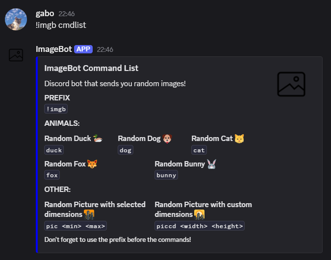

# 🖼️ ImageBot 

Discord bot that sends random images!

## Usage

### Prefix: `!imgb`

### 🤖 Command List



### 💡 Command Example
 
> Command: `!imgb duck`

 **Output:**


---

**Obs: This bot is currently not hosted and therefore not operational.**

If you wish to use the bot, please create your own application and clone the repository from GitHub. 

```bash
git clone https://github.com/gabohs/ImageBot.git
```

The API's used to get images do not require any API Keys, but make sure to create a .env file with your discord api token

```
> .env
BOT_TOKEN="Your_Token_Here"
```

Then run the project in the parent directory with

```go
go run .
```

Now, the bot should be online and ready to use!


